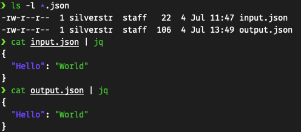

# Dolus
Dolus is a proof-of-concept (PoC) Python script used to hide data inside of JSON. This is useful for covert data exfiltration across an API by embedded data using insignificant bytes in JSON that parser think is whitespace and is ignored (and most intrusion detection sensors, WAFs and API Gateways).

The idea of this project comes [from an article](https://grimminck.medium.com/json-smuggling-a-far-fetched-intrusion-detection-evasion-technique-51ed8f5ee05f) I read on using JSON smuggling to evade intrusion detection sensors. So credit to Grimminck for the original idea.

## Usage

### Encode:
```bash
./dolus.py -i input.json -o output.json -x file.bin -e
```

### Decode:
```bash
./dolus.py -i output.json -o file.bin -d
```

## How does it work?
If you look closely at [RFC8259](https://datatracker.ietf.org/doc/html/rfc8259#section-2) for the grammer of JSON you will notice that several characters are considered "insignificant whitespace" and are ignored or parsed out when processing JSON. These include _Spaces_, _Tabs_, _Line Feeds_, and _Carriage Returns_:

```text
ws = *(
    %x20 /              ; Space
    %x09 /              ; Horizontal tab
    %x0A /              ; Line feed or New line
    %x0D )              ; Carriage return
```

Knowing that, we can use this whitespace to encode arbitrary data we want to exfiltrate in a way that a human will probably not notice it, since its pretty much invisible to the naked eye.

Let me show you, what I mean. After Dolus is run we can definitely see the size of the file has changed. Yet a JSON parser like jq notices nothing:



So, you know how binary (base 2) can be represented with 1s and 0s? Why not derive our own encoding using the 4 whitespace characters in a base 4 representation?

For simplicity, I am appending this to the end of a JSON object using a demark sequence of CR LF TAB SPACE (\x0d\x0a\x09\x20). Anything found after that demark is base4 encoded making it fast to inject and strip exfiltrated data as the JSON payload goes across the wire.

## Dolus??
In classical mythology, [Dolus is all about deception](https://en.wikipedia.org/wiki/Dolus). That seemed fitting here.